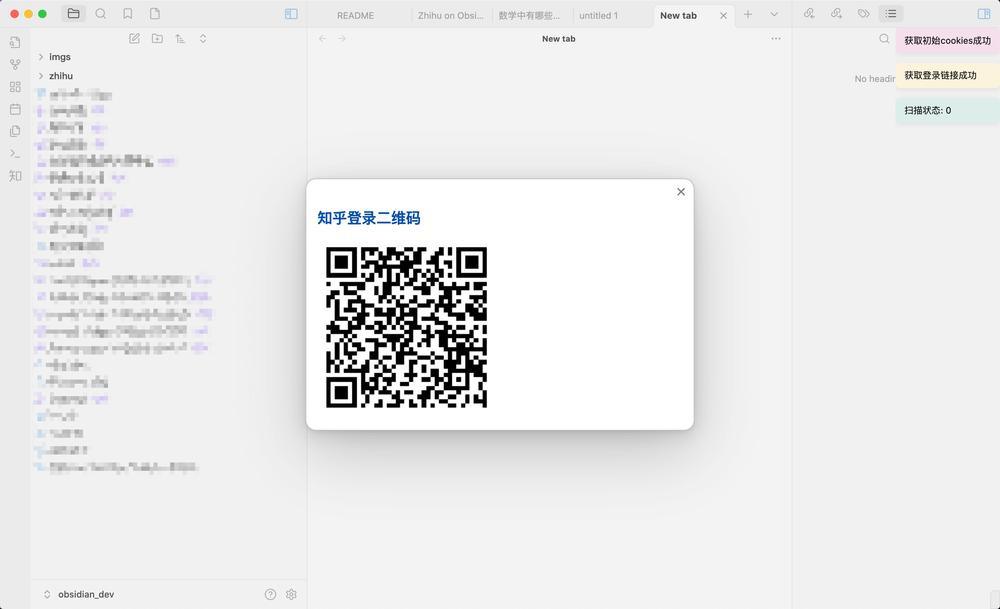
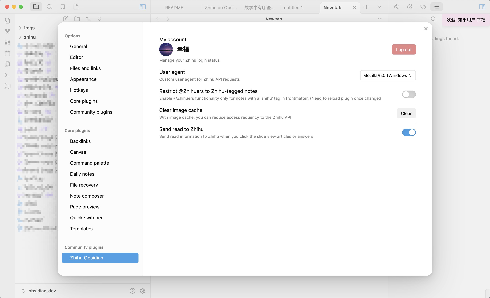
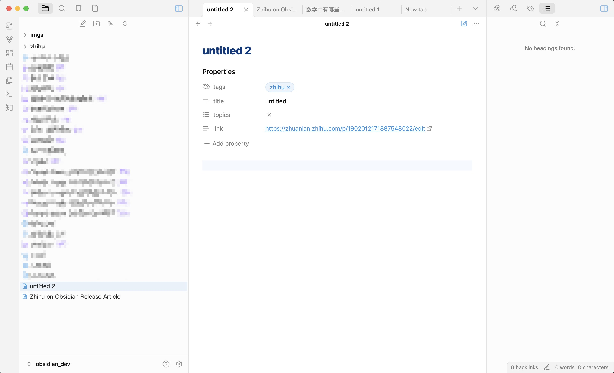
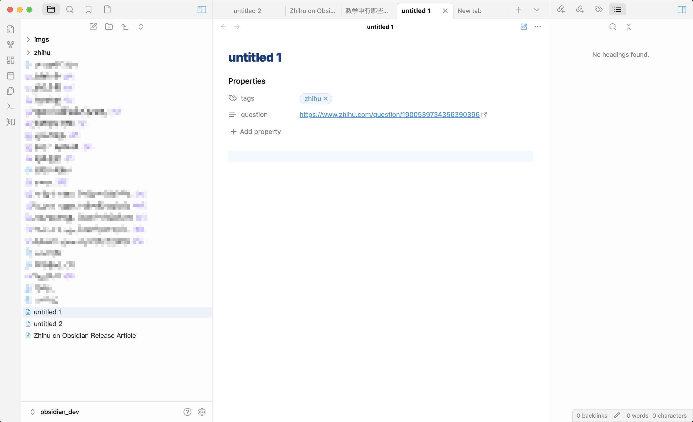
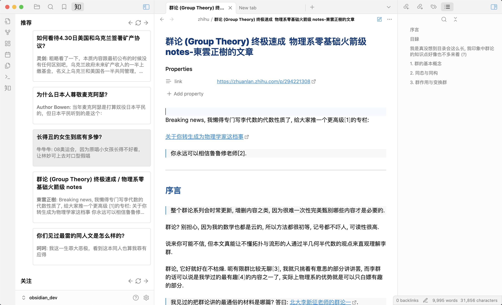
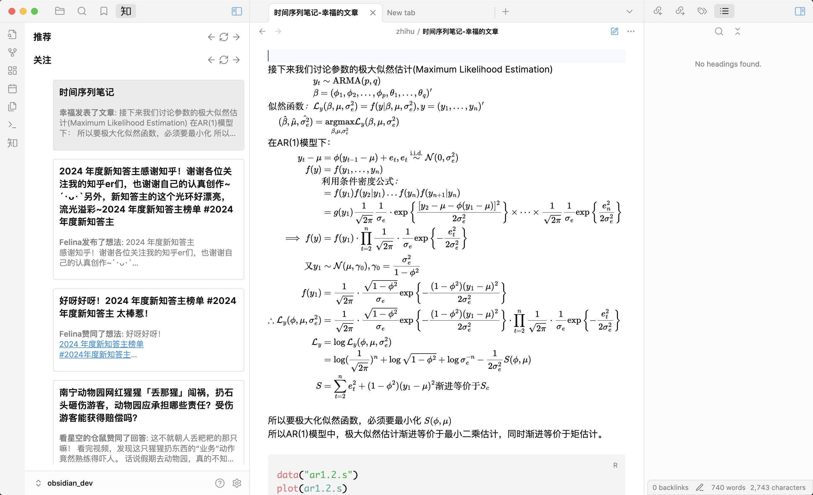
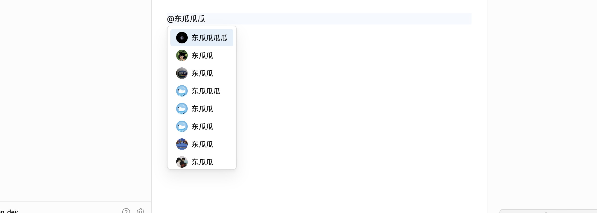
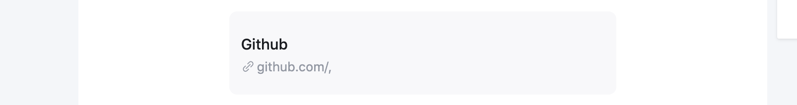
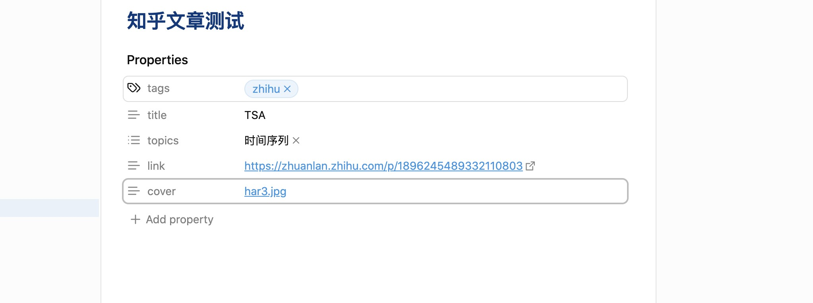

<div align="center">
<picture>

</picture>
<h1>Zhihu On Obsidian</h1>

[中文 README](./README_CN.md)

</div>

## Features

This plugin allows you publish your markdown file directly to [Zhihu](https://www.zhihu.com), a Chinese question-answer platform. The main features include:

- create and publish Zhihu articles
- create and publish Zhihu answers
- submit your article to Zhihu question.
- browse customized Zhihu recommendations, followings and hot lists.

## Usage

### Login to Zhihu

You can login to Zhihu by the command `Zhihu: QRCode login`, then you will see a QRCode. Open Zhihu app and scan it, the plugin will fetch all cookies and user data automatically. (**The plugin will never, ever upload your information**)



Open the `settings->Zhihu Obsidian`, an account and avatar indicates that the login is successful.



### Publish Articles

After you login, you can publish answers and articles to Zhihu. Here is the process:

Open command palette, type `Zhihu: Create new article`, the plugin will automatically create a zhihu article draft and a markdown file.



The created markdown file have four properties:

- tags: **required** to have `Zhihu`, or you can't publish.
- title: default `untitled`, you may change it before publish.
- topics: default none, you should add some, it is also **required**.
- link: URL to your draft or articles

After you typed some markdown and ready to publish, you can run command `Zhihu: Publish current file`. After doing that, the plugin will translate your markdown to Zhihu featured HTML, and publish it to Zhihu. You may **wait a few seconds** before you can actually see the article on Zhihu.

### Publish answers

Open command palette, type `Zhihu: Create new answer`, the plugin will ask you to enter the question link. For example, you would like to answer question `https://www.zhihu.com/question/1900539734356390396`. Type the link to the modal and press enter, a new answer draft will be created.



There are no properties you should fulfill, just type your thoughts or experience and run command `Zhihu: Publish current answer`. That's it, the answer URL then appear in the `link` property. You can also edit your answers anytime with the same command.

It is worth mentioning that **you can't create two answers in one question**, witch means that if you've created an answer (or answer draft) for a question, you can't create it again. In this situation, **you should manually edit properties: tags, questions and link**. Then run publish command will update your answer.

### Browsing

The plugin can also browse Zhihu recommendations, followings and hot lists. By clicking left side Zhihu icon (Chinese character `知`), you can directly view answers or articles in Obsidian. The markdown file will saved in `vault/zhihu/`



The LaTeX syntax is shown natively.



## Syntax

### At Zhihu members

Just type `@` and magic appears. You can select anyone by press enter or just click on it. Click the `@` link can bring you to the homepage of the zhihu member.



The syntax of at link is `[@name](https://www.zhihu.com/member_id "member_mention + hash")`

### Card links

It also dead easy to change your link into card. For example, you can use that to change GitHub link into a card titled `Github`.

```
[Github](https://github.com/, "card")
```

The result:



### Images

Just insert your images with markdown syntax, and the plugin will do the rest. If the images are local, use the Obsidian flavored `![[image|caption]]` syntax. If the images are online, use GFM syntax: ``. The plugin will automatically download the URL and upload to Zhihu.

Please **DO NOT** use the `` syntax for local images, or they may not be uploaded properly.

### Article cover

The plugin also support adding your favorate cover to the article. Just add `cover` entry to properties and select pictures using `[[img]]` syntax. Like that



## Contribution

Any PRs are welcome.

You can fork this repo to `vault/.obsidian/plugins`, make sure your NodeJS is at least v16

- `npm i` or `yarn` to install dependencies.
- `npm run dev` to start compilation in watch mode.
- `npm run build` to build a release.

## TODO

- [ ] add: mermaid support
- [ ] add: desmos-graph support
- [x] add: reference syntax
- [ ] add: view upvotes number in status bar
- [ ] add: view comments
- [x] add: upload your images on cloud
- [ ] add: publish articles to your column

## Support

You can support me by star⭐ the repo!

https://github.com/dongguaguaguagua/zhihu_obsidian/stargazers
