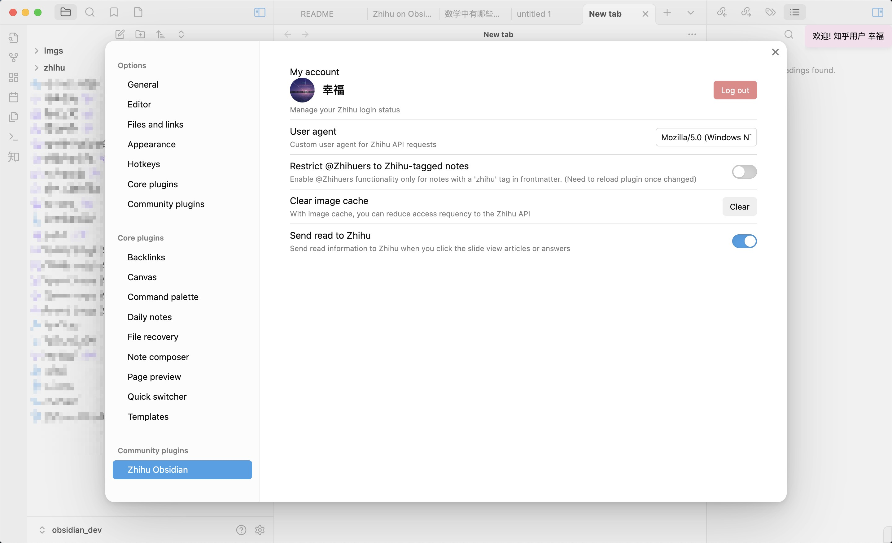
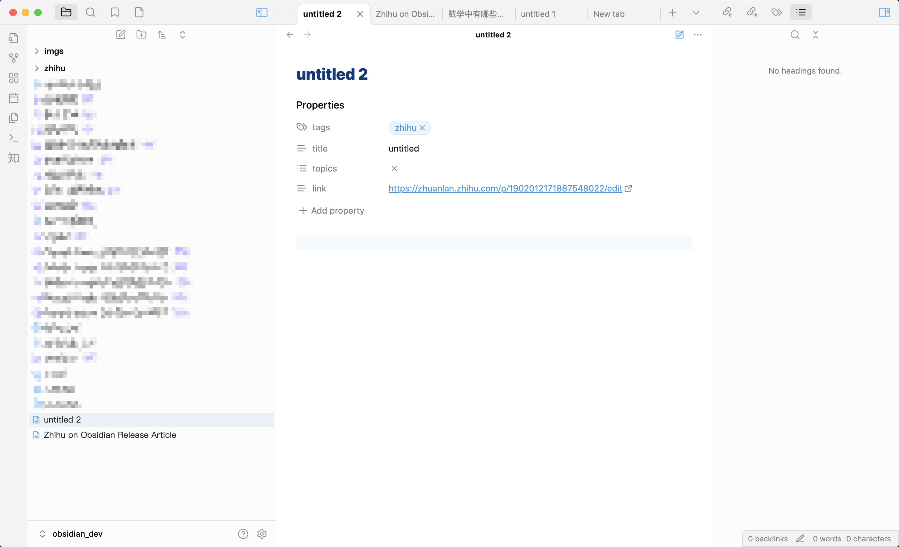
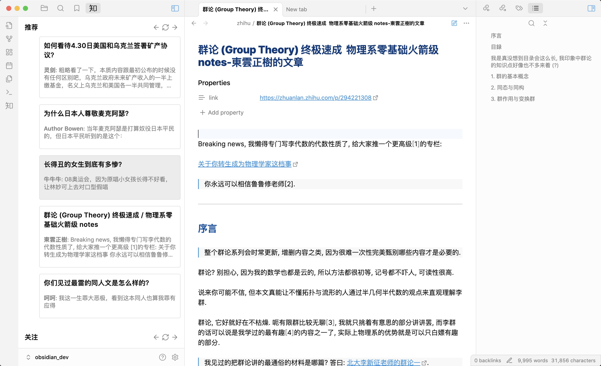
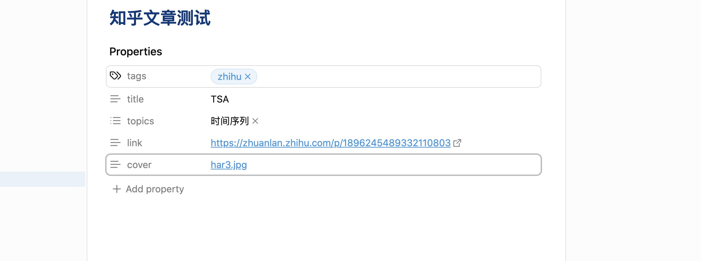

<div align="center">
<picture>

</picture>
<h1>Zhihu On Obsidian</h1>

[中文 README](./README_CN.md)

</div>

## 核心功能

Zhihu on Obsidian允许你在Obsidian内将markdown内容直接发布到知乎（中文问答平台）。该插件包含以下几点核心功能：

- 创建并发布知乎文章
- 创建并发布知乎回答
- 将知乎文章投稿至问题
- 浏览首页推荐、关注、热榜，并直接在Obsidian内查看。

## 使用方法

### 登录知乎

可以通过运行 `Zhihu: QRCode login` 命令，唤出知乎二维码。然后打开知乎app扫码登录，插件会自动获取所有需要的cookie和用户信息。(**插件永远不会上传你的用户信息**)


打开`设置->Zhihu Obsidian`, 如果看到你的头像和账号可以正常显示，说明登录成功。



### 发布文章

登录后你就可以发布文章了。

打开命令面板，键入 `Zhihu: Create new article` ，插件就会自动创建一个知乎文章草稿，并创建一个markdown文件。



创建的markdown文件有四个属性（property）

- 标签(tags): **必须**含有`zhihu`，否则无法发表
- 标题(title): 默认为`untitled`, 你可以后续进行修改
- 话题(topics): 默认为空，添加话题是**强制**的
- 链接(link): 你的文章的URL

在写完文章准备发表的时候，运行命令 `Zhihu: Publish current file` 即可。插件会将markdown转换为知乎HTML。在真正看到知乎上的文章之前，你可能需要等上几秒（或几分钟）。

### 发布回答

打开命令面板，键入 `Zhihu: Create new answer` ，插件会要求你输入问题的链接。比如你想要回答问题：`https://www.zhihu.com/question/1900539734356390396`，直接将链接放在弹窗中，按回车，插件就会为你创建回答草稿。


回答草稿中不需要填写任何属性，直接写完回答后运行命令 `Zhihu: Publish current answer`。然后回答链接就会出现在 `link` 属性中。用同样的命令也可以更新回答。

但需要注意，你**不能在同一个问题下创建两次回答**（包括回答草稿）。如果你已经回答过了这个问题，你应该**手动编辑属性：添加tags, questions, link**。再运行发布命令就可以成功更新回答了。

### 浏览

你也可以通过插件浏览知乎的推荐、关注和热榜。点击左侧知乎图标，就可以浏览推荐、关注和热榜了。点击回答或者文章会直接在Obsidian中打开，markdown文件会保存在`vault/zhihu/`下面。



LaTeX公式也可以正常显示


## 语法

### 艾特知乎用户

只要键入`@`即可，选择你想要艾特的知友，enter键选中。点击`@`链接会进入知友的知乎主页。


链接的语法是 `[@name](https://www.zhihu.com/member_id "member_mention + hash")`

### 卡片链接

将链接变成卡片也非常简单。比如将GitHub官网变成带有GitHub标题的卡片，可以这么写

```
[Github](https://github.com/, "card")
```

效果


### 文章封面

插件也可以让你一键上传你最爱的封面图片。只要在属性(property)中添加`cover`条目，然后键入`[[img]]`选择图片。就像这样



### 图片

你只需要使用markdown语法插入图片，插件就会帮你完成剩下的工作。对于本地图片，请使用Obsidian推荐的语法：`![[image|caption]]`。而对于网络图片，请使用``语法，插件会自动下载网络图片并上传到知乎。

注意，请**不要**使用``语法上传本地图片，否则图片可能无法完成上传。

## 贡献

欢迎任何PR

你可以fork这个仓库到 `vault/.obsidian/plugins` 下面，并确保NodeJS版本至少 v16

- 运行`npm i` 或者 `yarn` 安装依赖
- `npm run dev` 开启编译监视模式
- `npm run build` 可以发布一个release版本

## TODO

- [ ] 添加：mermaid 支持
- [ ] 添加：desmos-graph 支持
- [x] 添加：参考文献支持
- [ ] 添加：状态栏显示点赞数、收藏数
- [ ] 添加：评论查看
- [x] 添加：图片不来自本地或知乎图床也可发布
- [ ] 添加：文章发表到自己的专栏

## 支持我的开发

点个星星⭐来支持我！

https://github.com/dongguaguaguagua/zhihu_obsidian/stargazers
